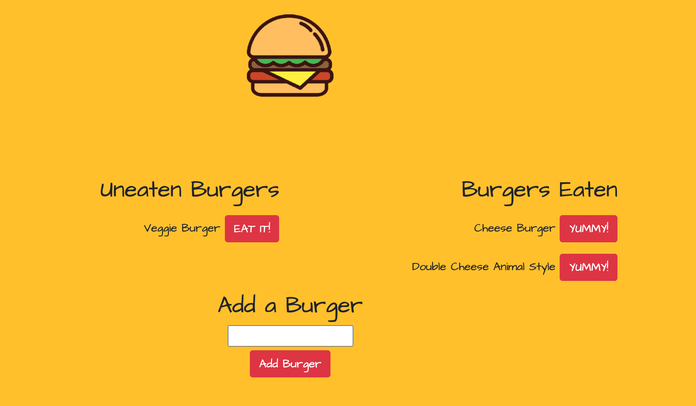

# burgerLogger
Node Express Handlebars

## Installation

<hr />

## Tech Used

* JavaScript
* NPM
    * inquirer
    * mySQL
    * express
        * handlebars
* SQL
* Databases
* Heroku

<hr />

## Sample



<hr />

## Description

The purpose of this project was to create an app that logs burgers. It starts with a user in put of a desired burger and produces it to a list called uneaten burgers. when EAT IT is clicked then the burger is moved to a list called burgers eaten. 

A database was created to store the data regarding burgers. The database goes through a connection that communicates to the ORM file. 

```
if (process.env.JAWSDB_URL){
  connection = mysql.createConnection(process.env.JAWSDB_URL)
}else{
  connection = mysql.createConnection({
    host: "localhost",
    user: "root",
    password: "password",
    database: "burgers_db"
  });
}
```
if the JAWSDB connection isn't available, it uses a local host.

```
  selectAll: function (tableInput, cb) {
    var queryString = 'SELECT * FROM ' + tableInput + ';';
    connection.query(queryString, function (err, result) {
      if (err) {
        throw err;
      }
      cb(result);
    });
  },
```

This then distributes information to the models to create the callback. This is then exported to the controller file to produce the get, post, put, and delete methods.

```
router.get('/', (req, res) => {
    burger.all(function(data){
        var obj = {
            burgers: data
        };
        console.log(obj);
        res.render('index',obj);
    })
});
```

Handlebars was used to create the HTML files. A partial handlebars file was used to produce buttons with the proper tags.

```
<p>
    {{burger_name}}

    <button class='burger-devour btn btn-danger' data-id='{{id}}' data-newDevour='{{devoured}}'>
        {{#if devoured}} YUMMY! {{else}} EAT IT!{{/if}}
    </button>

</p>
```


<hr />

## License

MIT License

Copyright (c) 2020 Jennifer Henry

Permission is hereby granted, free of charge, to any person obtaining a copy of this software and associated documentation files (the "Software"), to deal in the Software without restriction, including without limitation the rights to use, copy, modify, merge, publish, distribute, sublicense, and/or sell copies of the Software, and to permit persons to whom the Software is furnished to do so, subject to the following conditions:

The above copyright notice and this permission notice shall be included in all copies or substantial portions of the Software.

THE SOFTWARE IS PROVIDED "AS IS", WITHOUT WARRANTY OF ANY KIND, EXPRESS OR IMPLIED, INCLUDING BUT NOT LIMITED TO THE WARRANTIES OF MERCHANTABILITY, FITNESS FOR A PARTICULAR PURPOSE AND NONINFRINGEMENT. IN NO EVENT SHALL THE AUTHORS OR COPYRIGHT HOLDERS BE LIABLE FOR ANY CLAIM, DAMAGES OR OTHER LIABILITY, WHETHER IN AN ACTION OF CONTRACT, TORT OR OTHERWISE, ARISING FROM, OUT OF OR IN CONNECTION WITH THE SOFTWARE OR THE USE OR OTHER DEALINGS IN THE SOFTWARE.


<hr />
<hr />

# Author

* [LinkedIn](https://www.linkedin.com/in/jennifer-henry-4a540a149/)
* [GitHub](https://github.com/jenryhennifer)
* jenhenry1995@gmail.com
